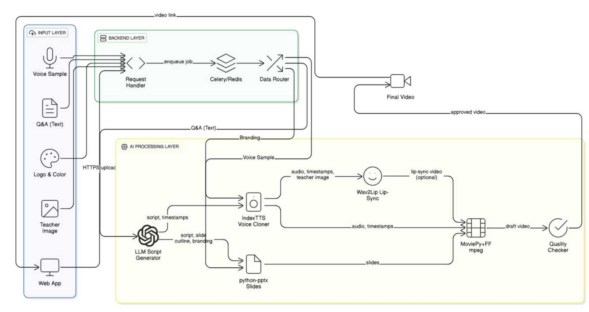

#  Flash — The Next-Gen Multimodal Content Generator

This project was created by **Team CamelCase**, including: [Anannya](https://github.com/anannya-wakalkar), [Gauri](https://github.com/Gauri-Gaikwad), and [Abhinav](https://github.com/bombaleabhinav) for the ** X-Fair Hackathon**.

---

### Overview

**Flash** is an advanced **multimodal generative AI pipeline** that automates the end-to-end process of video creation.  
Flash is a multimodal generative AI system that automatically converts a question-and-answer pair into a fully synchronized, branded educational video — featuring a cloned teacher’s voice and personalized, context-aware visuals.

---

## Features

- **Multimodal AI Core** — Handles text, image, and audio inputs simultaneously.  
-  **Voice Cloning** — Clone a speaker’s voice from a 10s reference clip using IndexTTS or compatible APIs.   
-  **Dynamic Design Engine** — Applies brand colors, logo, and layout style automatically.  
- **Batch Mode** — Supports CSV/QnA file processing for bulk video generation.  
- **Modular Architecture** — Run each stage (script, voice, slides, render) independently or together.

---

## System Architecture

