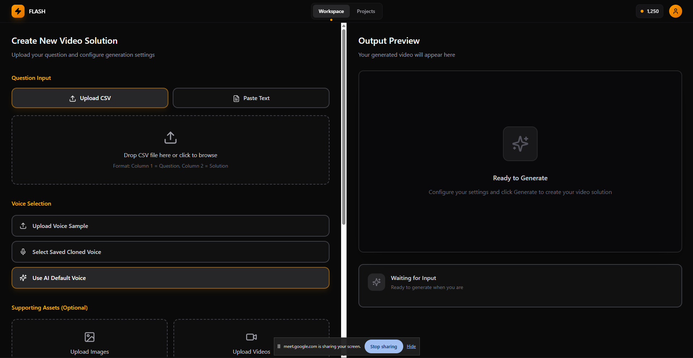

#  Flash — The Next-Gen Multimodal Content Generator

This project was created by Team **CamelCase**, including: [Anannya](https://github.com/anannya-wakalkar), [Gauri](https://github.com/Gauri-Gaikwad), and [Abhinav](https://github.com/bombaleabhinav) for the **X-Fair Hackathon**.

---

---

### Overview

**Flash** is an advanced **multimodal generative AI pipeline** that automates the end-to-end process of video creation.  
Flash is a multimodal generative AI system that automatically converts a question-and-answer pair into a fully synchronized, branded educational video — featuring a cloned teacher’s voice and personalized, context-aware visuals.

---
### UI Preview

---

## Features

- **Multimodal AI Core** — Handles text, image, and audio inputs simultaneously.  
-  **Voice Cloning** — Clone a speaker’s voice from a 10s reference clip using IndexTTS or compatible APIs.   
-  **Dynamic Design Engine** — Applies brand colors, logo, and layout style automatically.  
- **Batch Mode** — Supports CSV/QnA file processing for bulk video generation.  
- **Modular Architecture** — Run each stage (script, voice, slides, render) independently or together.

---

## System Architecture

--- 

## Tech Stack 

### Frontend
- **HTML5**
- **CSS3**
- **JavaScript**
- **React.js**

---

### Python Libraries & Tools
- **MoviePy** – Video creation and editing  
- **OpenCV** – Image and video processing  
- **FFmpeg** – Media encoding and processing  
- **Pandas** – Data handling and preprocessing  
- **Webview** – Lightweight desktop/web view integration  

---

### AI / ML Models
- **Ollama Gemma3** – Script and content generation  
- **IndexTTS** – Voice cloning and text-to-speech  
- **Wav2Lip** – Lip-sync generation   

---

## Impact & Benefits

- **Instant Video Generation at Scale**  
  Teachers and educators spend hours creating video content — our AI generates high-quality videos in **minutes**.

- **Automated Video Creation**  
  Our multimodal GenAI system converts simple **question–answer pairs** into **sleek, branded explainer videos** automatically.

- **Faster, Smarter Education Delivery**  
  Designed to revolutionize how **coaching institutes and EdTech platforms** deliver educational content at scale.

- **Q&A to Video in Minutes**  
  Turn any question and answer into a **ready-to-use explainer video** with zero manual effort.

- **No Editing. No Recording. No Hassle.**  
  Focus on teaching — the AI handles everything else.

